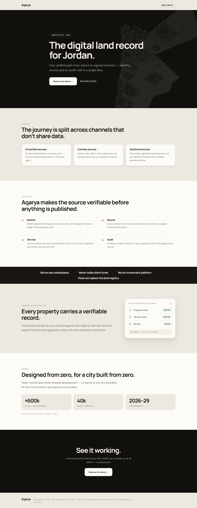
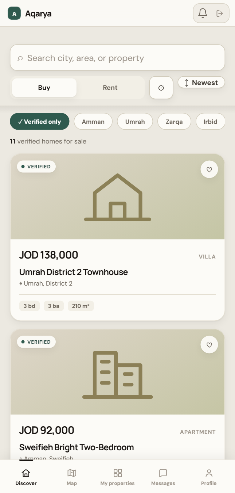
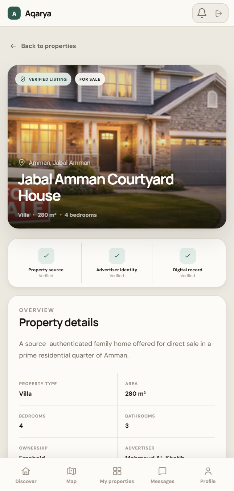
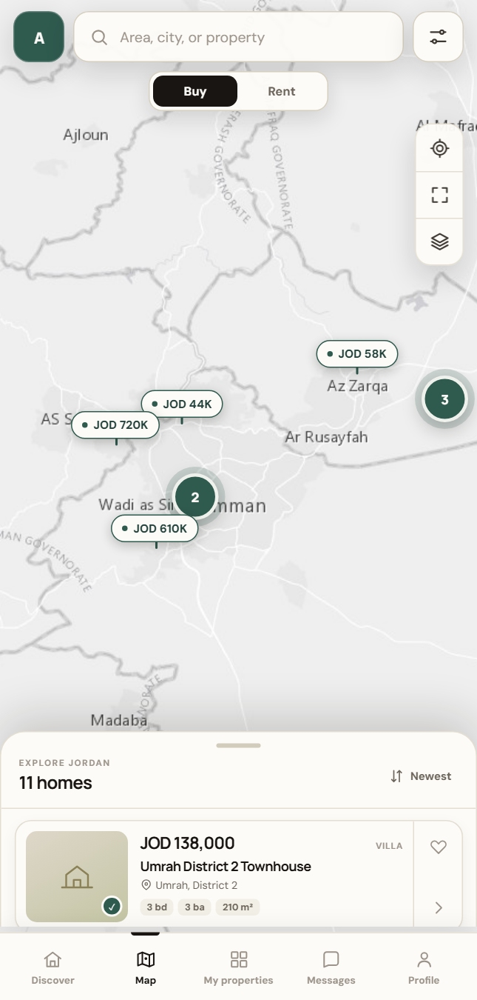
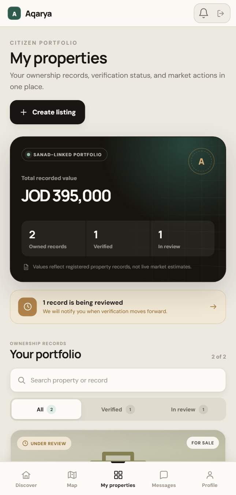
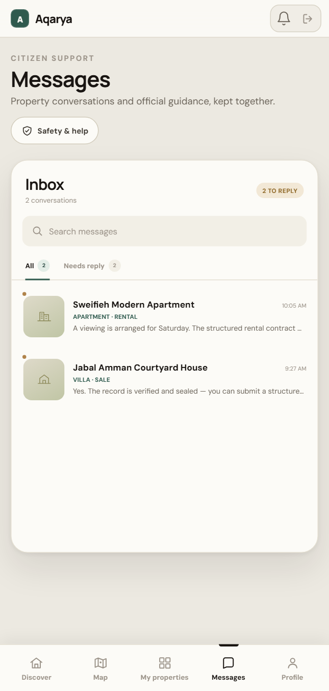
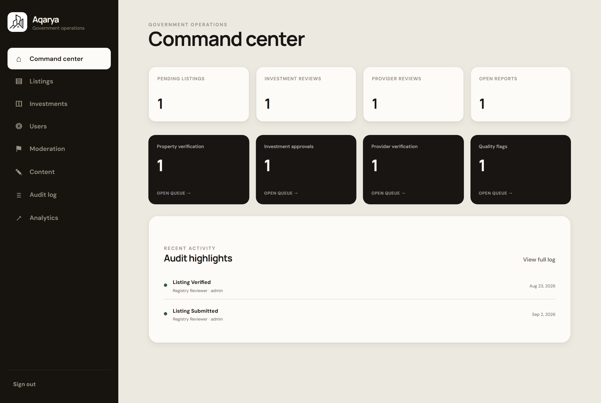

# Aqarya

**A digital trust and operations layer for property in Jordan** — a frontend
demonstration of what a source-authenticated, SANAD-gated property journey
could look like, piloted for the new city of Umrah.

Aqarya is not an ads marketplace, never holds client funds, and is not an
investment platform. It does not replace the Department of Lands and Survey —
legal ownership, registration, and payment stay with the competent
authorities. What it proposes is one verified path from search to signed
contract: **identity → source → structured service → audit trail**, instead
of a search box bolted onto paperwork.

This repository is the **frontend only**. There is no backend or database —
every `src/api/*` call resolves against an in-memory mock store
(`src/mock/db.ts`), seeded with ~20 listings across Amman, Umrah, Zarqa,
Irbid and Aqaba. State lives for the browser tab and resets on reload.

▶ **Live demo:** [aqarya.online](https://aqarya.online)

## What's in it

**Public**
- **Landing page** (`/`) — the pitch: the gap, the four-layer model
  (Identity / Source / Service / Audit), what Aqarya deliberately doesn't do,
  the verification-record visual, the Umrah pilot figures, and a "try the
  demo" close.
- **Entry** (`/login`) — two buttons, no password: *Login with SANAD*
  (citizen) or *Admin access* (government console).

**Citizen app** — mobile-width only (a centered ~430px shell with a bottom
tab bar), the same shape as a native app:
- **Discover** — search, Buy/Rent, a filter sheet (price band, beds, type,
  city, verified-only), sort, and listing cards with a generated on-brand
  cover when there's no photo.
- **Map** — a real Leaflet map (Esri "Light Gray" tiles, no API key) with
  clustered price pins, a draggable results sheet with snap points, and a
  preview card when you tap a pin.
- **Property record** — full detail plus a "Verified property record"
  credential: source and identity checks, a sealed record hash, and a
  timestamp.
- **Structured offer** — a short multi-step flow (amount, validity, funding
  method, consent) that ends in a reference receipt, standing in for a real
  offer/lease submission.
- **My properties** — a citizen's ownership portfolio: recorded value,
  verification progress, and a route into listing a verified property for
  sale.
- **Messages, Notifications, Profile, Help.**

**Admin console** — desktop layout, dark sidebar: registry review (verify /
request changes / reject / freeze), investment-opportunity governance,
user & provider verification, a moderation queue, content/announcements, an
audit log, and analytics.

## Screenshots

| | |
|---|---|
|  |  |
|  |  |
|  |  |
|  |  |

## Stack

React 19 · TypeScript · React Router 7 · Vite · Leaflet + Leaflet.markercluster.
No server, no database — see `src/mock/db.ts`.

## Run it

```bash
npm install
npm run dev
```

Open `http://localhost:5173`.

## Verify

```bash
npm run verify   # typecheck + lint + vitest + production build
```

## Deploy

Static build (`npm run build` → `dist/`) served by nginx on a VPS, behind a
shared Caddy reverse proxy for TLS. `.github/workflows/deploy.yml` builds and
rsyncs `dist/` on every push to `main`. Details in [`DEPLOY.md`](./DEPLOY.md).

## Layout

```text
src/
  api/        Typed clients — each resolves against the mock store, no network
  mock/db.ts  In-memory seed data + mutations for the whole demo
  assets/     Images
  store/      Auth = a role flag in localStorage
  web/
    pages/    Route-level screens (citizen, admin, landing, login)
    Layout.tsx, ui.tsx   Shared shell, icons, and UI primitives
```
